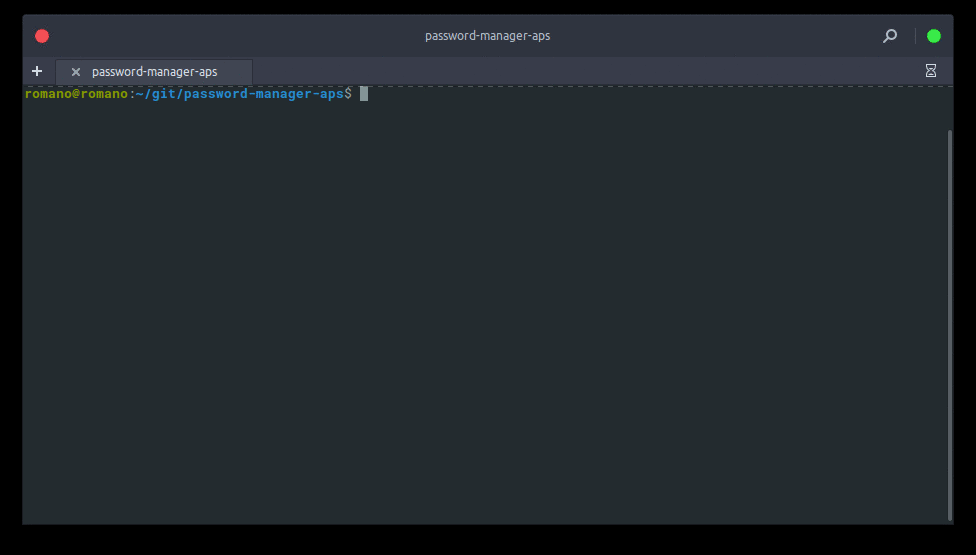

# Password manager software

A password manager written in python(2.7), developed using Advanced Encryption Standard (AES) and Secure Hash Algorithm (SHA-256). MongoDB is used for local data storage.

<p align="center">
  
</p>

This GIF was created with [ttygif](https://github.com/icholy/ttygif) (repository link)
# Installation

Install MongoDB:

[MongoDB Installation](https://docs.mongodb.com/manual/installation/?jmp=footer&_ga=2.168173224.803608867.1506133999-480232443.1506015152)

Clone repository:

```bash
$ git clone https://github.com/ViniciusRomano/password-manager-aps.git
$ cd password-manager-aps
```

Install requirements:

```bash
$ pip install -r requirements.txt
```

# Run
Copy and paste the following line into a terminal window.
```bash
$ python main.py
```
